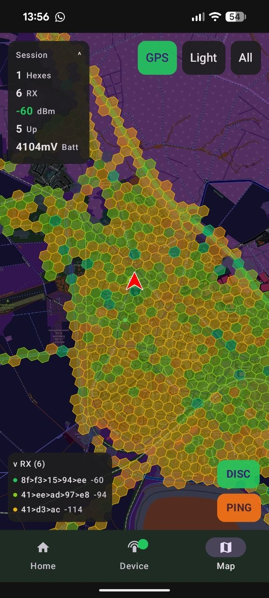

# MeshCore Coverage Mapper

Map the coverage of the [MeshCore](https://meshcore.net) LoRa mesh network — right from your phone.

Connect your MeshCore device via Bluetooth, drive around, and the app records signal coverage automatically. Data is uploaded to [mapme.sh](https://mapme.sh) where it becomes part of the community coverage map.

## Download

- **Google Play** — Closed Beta (coming soon)
- **F-Droid** — Submitted, pending review
- **Direct APK** — [Download latest release](https://github.com/dirkforpresident/mesh-mapme-android/releases/latest)

## Features

- Connect to any MeshCore device via Bluetooth Low Energy
- Real-time signal mapping with GPS tracking
- H3 hexagon coverage visualization with RSSI color coding
- Dark and light map themes
- Session statistics (hexes, RX count, uploads, battery)
- Contact discovery and RSSI display
- Background mapping — keep mapping with the screen off
- Android Auto support

## Privacy Modes

| Mode | Behavior |
|------|----------|
| **Live** | Instant upload, visible on map in real-time |
| **Normal** | Data uploaded with 3-hour delay |
| **Ghost** | Data uploaded with 24-hour delay, anonymous |

No account required. No ads, no tracking, no analytics.

## How it works

1. Your phone connects to a MeshCore node via BLE
2. The app tracks your GPS position and listens for mesh signals
3. Each position is mapped to an H3 hexagon (~15m resolution)
4. Signal strength from nearby repeaters is recorded
5. Data is uploaded to mapme.sh with cryptographic verification
6. The community coverage map grows with every drive

## Links

- [mapme.sh](https://mapme.sh) — Live coverage map
- [MeshCore](https://meshcore.net) — Mesh network firmware
- [HanseMesh](https://hansemesh.de) — Community

## License

MIT — see [LICENSE](LICENSE)
